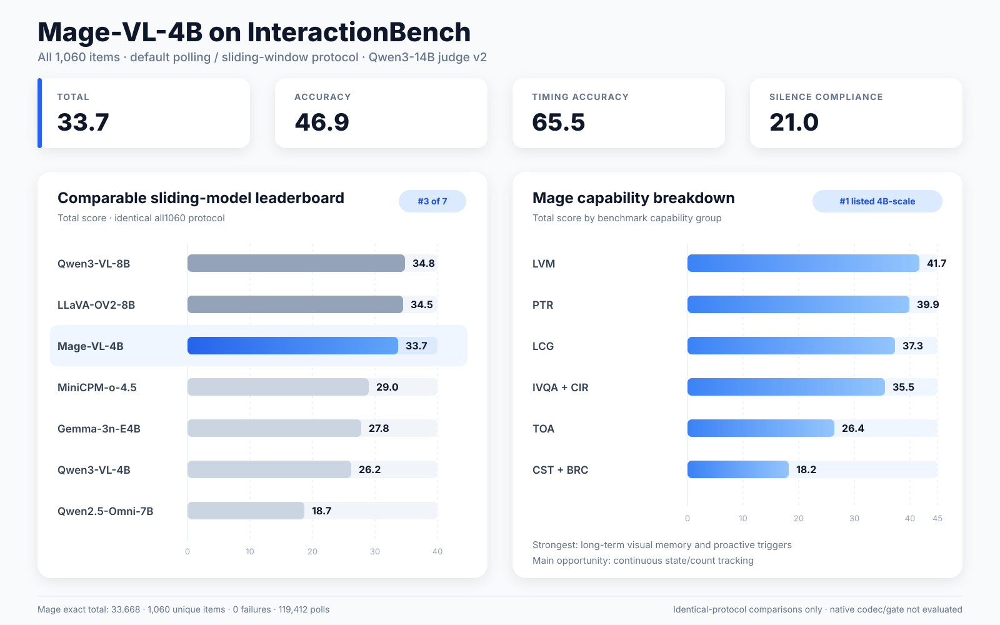

# Mage-VL-4B on InteractionBench

Mage-VL-4B was evaluated on all 1,060 InteractionBench items with the default
turn-based polling protocol: a one-second polling interval, a two-FPS frame sampler,
and a 16-frame sliding window. Free-form answers were scored by Qwen3-14B using the
v2 judge prompt; multiple-choice answers were option-scored.

| Evaluation | Items | Total | Accuracy | Timing Accuracy | Silence Compliance |
|---|---:|---:|---:|---:|---:|
| Full benchmark | 1,060 | **33.668** | 46.856 | 65.454 | 21.034 |
| MCQ subset | 688 | **34.903** | 57.916 | 73.912 | 15.364 |

The full run produced 1,060 unique prediction rows with zero failures across
119,412 polling decisions. Under the identical default sliding-window configuration,
Mage-VL-4B ranks third among the models currently listed in `paper_runs.json`, behind
Qwen3-VL-8B (34.8) and LLaVA-OV2-8B (34.5).

## Scope

This is an apples-to-apples InteractionBench evaluation through its generic
frame-sampled, multi-image VLM adapter. It does not measure Mage-VL's native codec
processor or visual-only proactive gate; those require a separate native-streaming
runner and should be reported as a distinct protocol.
